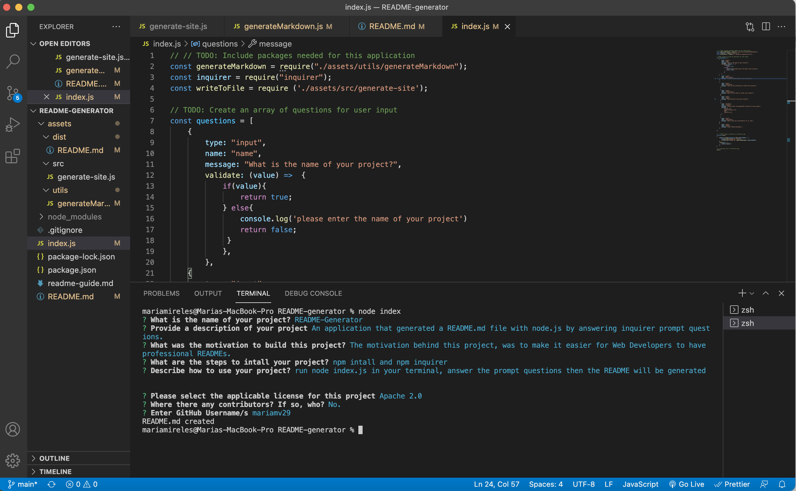

# README Generator 

## Description 

The README Generator is an application that allows user input to generate a README.md by using node.js and inquirer prompts. 

After going over the prompt questions the README.md file will be generated in the dist folder inside the assets folder: "../assets/dist/README.md"


## Table of Contents (Optional)

If your README is very long, add a table of contents to make it easy for users to find what they need.

* [Installation](#installation)
* [Usage](#usage)
* [Credits](#credits)
* [License](#license)


## Installation

`npm install` >
`npm inqurer` 


## Usage 

To use the README-Generator:
1. Open the terminal 
2. In the root of your directory run `node index.js` command
3. Answer the prompt questions. 


```md

```


---

🏆 
## Badges


## Contributing / Credits

[mariamv29](https://github.com/mariamv29/README-generator.git)

